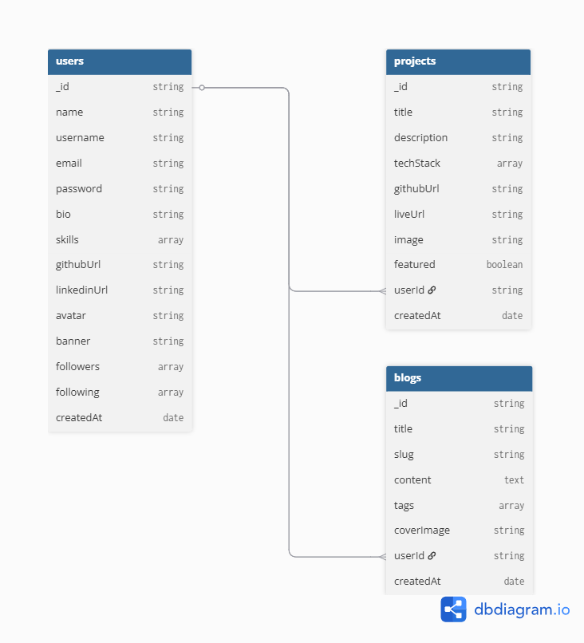

<div align="center">
  
  <h1>DevHub</h1>
  <p><strong>The Developer Social Platform</strong></p>
  <p>Showcase your projects, share your knowledge, and connect with developers worldwide.</p>

  <p>
    <a href="#features">Features</a> •
    <a href="#tech-stack">Tech Stack</a> •
    <a href="#installation">Installation</a> •
    <a href="#database-schema">Database Schema</a>
  </p>
</div>

---

## 📖 Project Overview

DevHub is a modern, full-stack social network built specifically for developers. It serves as a unified platform where developers can showcase their portfolios, publish technical articles, and build a professional network.

The platform combines the best aspects of GitHub, Medium, and LinkedIn, offering a clean, developer-focused aesthetic without the noise of traditional social media. Whether you are a junior developer looking to share your learning journey or a senior engineer publishing in-depth technical guides, DevHub provides the perfect home for your work.

## ✨ Features

- **🔐 Authentication**: Secure user registration and login using JWT.
- **👨‍💻 Developer Profiles**: Comprehensive profiles featuring skills, experience, availability, and location.
- **🚀 Project Showcase**: Add, edit, and display projects with descriptions, tech stacks, and live links.
- **✍️ Blog System**: Publish technical articles and tutorials with reading time estimates.
- **🔍 Search & Discovery**: Find developers, projects, and blogs using an advanced search and filtering system.
- **🤝 Follow System**: Build your network by following other developers and curating your feed.
- **❤️ Likes & Bookmarks**: Interact with content and save your favorite projects and articles for later.
- **🐙 GitHub Integration**: Automatically fetch and display top repositories, languages, and GitHub stats.
- **📊 Responsive Dashboard**: Manage your content, view your activity feed, and track your followers.
- **🌓 Dark/Light Mode**: Full theme support for comfortable reading in any environment.

## 🛠️ Tech Stack

### Frontend
- **Next.js (App Router)** - React framework
- **JavaScript (JSX)** - Core language
- **TailwindCSS** - Utility-first styling
- **shadcn/ui** - Unstyled, accessible components
- **Framer Motion** - Fluid animations and transitions

### Backend
- **Next.js API Routes** - Serverless backend functions
- **MongoDB Atlas** - Cloud NoSQL database
- **Mongoose** - Object Data Modeling (ODM) library
- **JWT** - Stateless authentication

### Deployment
- **Vercel** - Frontend hosting
- **MongoDB Atlas** - Database hosting

## 📂 Folder Structure

```text
dev-hub/
├── public/                 # Static assets (images, icons)
├── src/
│   ├── app/                # Next.js App Router (pages & layouts)
│   │   ├── api/            # Backend API routes
│   │   ├── dashboard/      # Authenticated user dashboard
│   │   ├── explore/        # Discovery pages (projects, devs)
│   │   ├── profile/        # Public user profiles
│   │   └── blogs/          # Blog listing and detail pages
│   ├── components/         # Reusable UI components
│   │   ├── cards/          # Project, Blog, and Developer cards
│   │   ├── layout/         # Navbar, Sidebar, Shell
│   │   ├── shared/         # Common components (FollowButton, etc.)
│   │   └── ui/             # Base UI components (Button, Input, Badge)
│   ├── lib/                # Utility functions, DB connection, Auth
│   ├── models/             # Mongoose database schemas
│   └── providers/          # React context providers (Auth, Theme, Toast)
├── .env.local              # Environment variables (git-ignored)
└── tailwind.config.mjs     # Tailwind configuration
```

## 🚀 Installation & Setup

1. **Clone the repository**
   ```bash
   git clone https://github.com/yourusername/devhub.git
   cd devhub
   ```

2. **Install dependencies**
   ```bash
   npm install
   ```

3. **Set up environment variables**
   Create a `.env.local` file in the root directory and add your keys (see [Environment Variables](#environment-variables)).

4. **Run the development server**
   ```bash
   npm run dev
   ```

5. **Open the app**
   Navigate to [http://localhost:3000](http://localhost:3000) in your browser.

## 🔑 Environment Variables

To run this project, you will need to add the following environment variables to your `.env.local` file:

```env
# MongoDB Connection String
MONGODB_URI=mongodb+srv://<username>:<password>@cluster.mongodb.net/devhub

# JWT Authentication Secret
JWT_SECRET=your_super_secret_jwt_key_here

NEXT_PUBLIC_APP_URL=http://localhost:3000

# (Optional) GitHub API Token for increased rate limits
GITHUB_TOKEN=your_github_personal_access_token
```

## 🗄️ Database Schema

The application uses MongoDB with Mongoose for data modeling. The core entities and their relationships are visualized below:



### Collections
- **Users**: Stores profile data, auth credentials, and social connections (followers, following, bookmarks).
- **Projects**: Contains project metadata, tech stack, and a `likes` array referencing User IDs.
- **Blogs**: Stores article content, tags, and a `likes` array referencing User IDs.
- **Activities**: Tracks events (likes, follows, creates) to power the real-time activity feed.


## 🌐 Deployment

1. **Database**: Create a free cluster on [MongoDB Atlas](https://www.mongodb.com/cloud/atlas), configure network access (allow 0.0.0.0/0), and get your connection string.
2. **Hosting**: Push your code to GitHub and import the repository into [Vercel](https://vercel.com).
3. **Configuration**: Add your `MONGODB_URI` and `JWT_SECRET` to the Vercel project environment variables.
4. **Deploy**: Click Deploy! Vercel will handle the build process automatically.

## 🔮 Future Improvements

- [ ] **Realtime Notifications**: Push notifications for new followers, likes, and bookmarks.
- [ ] **Markdown Editor**: Enhanced blog writing experience with live markdown preview.
- [ ] **Messaging System**: Direct peer-to-peer messaging between developers.
- [ ] **AI Recommendations**: Personalized content suggestions based on user activity and skills.

---

<div align="center">
  <p>Built with ❤️ for developers.</p>
</div>
